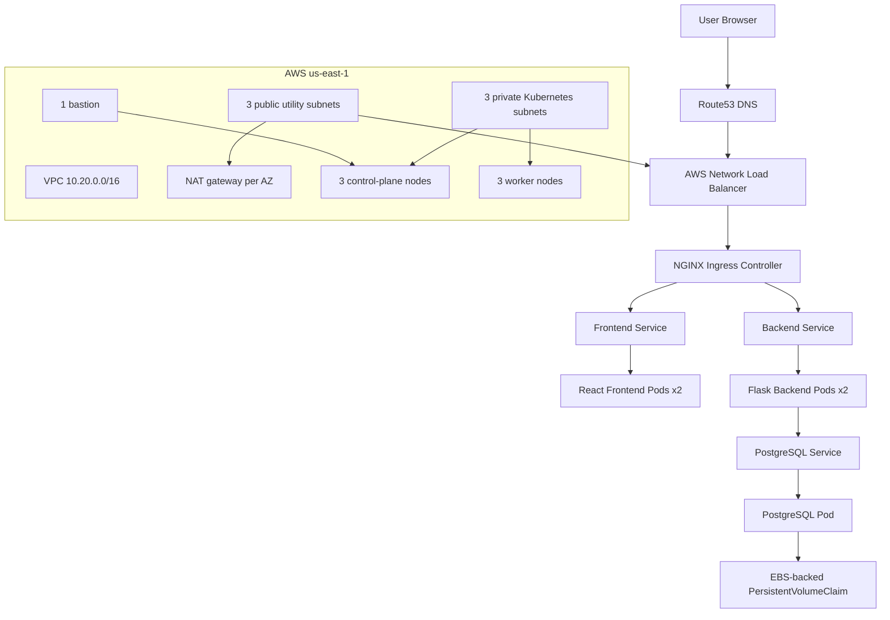

# TaskApp Production Architecture

This document describes the production-style AWS Kubernetes architecture used for the TaskApp Novara DevOps Engineering capstone.

## Executive Overview

TaskApp is deployed as a cloud-native application on an AWS Kubernetes cluster created with Kops and supported by Terraform-managed AWS foundation resources.

The deployment demonstrates a full DevOps delivery path:

- Dockerized React frontend and Flask backend
- PostgreSQL persistence through Kubernetes PVC backed by AWS EBS
- Kops-managed Kubernetes cluster across 3 Availability Zones
- Route53 DNS, AWS Load Balancer, NGINX Ingress, and cert-manager TLS
- Terraform-managed VPC, IAM, DNS, state backend, and Kops state bucket
- Operational evidence for cluster health, HTTPS, recovery, and persistence

## Architecture Diagram



## Request Flow

1. A user opens `https://taskapp.axiomdlabs.online` or `https://api.axiomdlabs.online/api/health`.
2. Route53 resolves the domain to the AWS Load Balancer created for the NGINX Ingress Controller.
3. The AWS Load Balancer forwards traffic to NGINX Ingress.
4. NGINX routes frontend traffic to the frontend Kubernetes Service.
5. NGINX routes API traffic to the backend Kubernetes Service.
6. Backend pods connect to PostgreSQL through the PostgreSQL Service.
7. PostgreSQL stores data on an EBS-backed Kubernetes PersistentVolumeClaim.

## AWS Network Design

The Terraform foundation uses:

- VPC CIDR: `10.20.0.0/16`
- 3 Availability Zones in `us-east-1`
- 3 public utility subnets for NAT gateways and load balancers
- 3 private subnets for Kubernetes control-plane and worker nodes
- Internet Gateway for public subnet egress/ingress
- One NAT gateway per Availability Zone for redundant private-subnet egress
- Separate route tables for public and private subnet traffic

Public subnets are used for edge infrastructure. Kubernetes nodes are placed in private subnets.

## Kops Cluster Architecture

The Kops cluster is designed as a multi-AZ Kubernetes environment:

- 3 control-plane nodes
- 3 worker nodes
- 1 bastion host
- Private node topology
- Cilium CNI
- EBS CSI driver for persistent volume support
- etcd distributed across 3 Availability Zones
- Restricted Kubernetes API and SSH access CIDRs

This layout avoids a single control-plane instance and supports availability across Availability Zones.

## Application Architecture

TaskApp runs in the `taskapp` namespace:

- Frontend Deployment with 2 replicas
- Backend Deployment with 2 replicas
- PostgreSQL Deployment with an EBS-backed PVC
- ConfigMap for non-sensitive configuration
- Runtime Secret named `taskapp-secret` created outside Git
- Backend readiness and liveness probes on `/api/health`
- Frontend readiness and liveness probes on `/health`
- PostgreSQL readiness/liveness through `pg_isready`
- RollingUpdate strategy for backend and frontend
- Resource requests/limits defined for the backend

The Git repository includes a secret example only. Runtime secret values are created out-of-band before applying manifests to a fresh cluster.

## Security Model

Security controls include:

- No public external IPs on Kubernetes nodes
- Restricted Kubernetes API and SSH CIDRs
- IAM roles and instance profiles for cluster operations
- No AWS access keys, kubeconfigs, private keys, `.env` files, or Terraform state committed to Git
- TLS certificates issued by cert-manager using Let's Encrypt
- HTTP-to-HTTPS redirect at ingress
- HSTS header on HTTPS responses
- Terraform remote state stored in S3 with DynamoDB locking

## High Availability Strategy

Availability and recovery are addressed through:

- Multi-AZ control plane
- Multi-AZ worker nodes
- Redundant NAT gateways, one per Availability Zone
- AWS Load Balancer in front of NGINX Ingress
- etcd quorum distributed across Availability Zones
- Kubernetes Deployment controllers for pod recovery
- Backend and frontend replicas
- PostgreSQL storage backed by Kubernetes PVC on AWS EBS
- Recovery evidence showing backend pod restart and PostgreSQL pod restart behavior

## Backup Strategy

Kops handles cluster-level etcd backup configuration.

For PostgreSQL:

- Current capstone evidence validates PVC persistence after PostgreSQL pod restart.
- Production should add automated database backups.
- Recommended approach: scheduled `pg_dump` CronJob writing encrypted backups to S3.
- Additional protection: EBS snapshots or AWS Backup policies for the persistent volume.

Example documentation-only backup command:

```bash
kubectl -n taskapp exec deploy/postgres -- pg_dump -U taskapp_user taskapp > taskapp-backup.sql
```

This command is non-destructive, but production backup automation should write to durable storage such as S3 and include retention, encryption, and restore testing.

## Known Limitations

Known limitations for this capstone phase:

- PostgreSQL has not yet been migrated to Amazon RDS.
- GitOps is not yet implemented.
- A full CI/CD pipeline is not yet implemented.
- Runtime Kubernetes secrets must be created externally before a fresh deployment.
- Database backup automation is documented but not provisioned as AWS backup resources in this phase.
