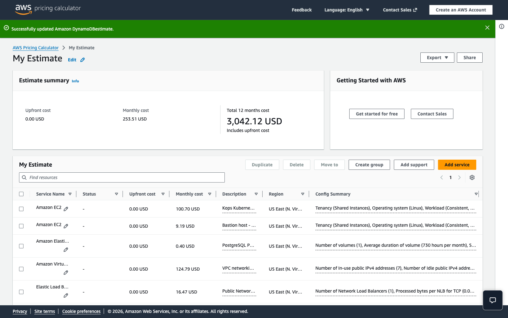

# Cost Analysis

This project is a temporary AWS capstone lab. Build, validate, record evidence, submit, and destroy nonessential AWS resources immediately after submission.

## Executive Cost Summary

The AWS Pricing Calculator estimate for the Novara Kops Kubernetes architecture in `us-east-1` is **253.51 USD per month** for 730 hours of usage. The estimated 12-month run rate is **3,042.12 USD**, but the cluster is intended for short-lived capstone/demo use, not continuous production operation.

The largest cost drivers are NAT Gateways, EC2 instance runtime, public IPv4 addresses, and the public Network Load Balancer. Actual billing depends on runtime, traffic, NAT data processing, public IPv4 charges, storage usage, and AWS price changes.

## AWS Pricing Calculator Evidence




## Monthly Estimate

| Service | Modeled usage | Estimated monthly cost |
| --- | --- | ---: |
| Amazon EC2 | 6 Linux `t3.small` Kops control-plane/worker nodes, on-demand, 730 hours/month, 20 GiB gp3 root volume each | 100.70 USD |
| Amazon EC2 | 1 Linux `t3.micro` bastion host, on-demand, 730 hours/month, 20 GiB gp3 root volume | 9.19 USD |
| Amazon EBS | 1 PostgreSQL PVC, 5 GiB gp3, 730 hours/month, no snapshot storage | 0.40 USD |
| Amazon VPC | 3 NAT Gateways, low data processing, 7 in-use public IPv4 addresses | 124.79 USD |
| Elastic Load Balancing | 1 public Network Load Balancer for NGINX Ingress, low TCP traffic | 16.47 USD |
| Amazon Route 53 | 1 hosted zone, low standard query volume | 0.90 USD |
| Amazon S3 | 5 GiB S3 Standard for Terraform state, Kops state, backups, and evidence with low requests | 0.12 USD |
| Amazon DynamoDB | On-demand table for Terraform state locking, 1 GiB storage and minimal read/write usage | 0.94 USD |
| **Estimated total** | **730-hour monthly projection** | **253.51 USD** |

## Cost Assumptions

- Region is `us-east-1` / US East (N. Virginia).
- Monthly projection assumes 730 hours of runtime.
- EC2 uses Linux, shared tenancy, on-demand pricing.
- The Kops cluster estimate includes 3 control-plane nodes and 3 worker nodes, all `t3.small`.
- The bastion estimate uses 1 `t3.micro`.
- EC2 root volumes are gp3, 20 GiB per node.
- PostgreSQL persistent storage is modeled as a separate 5 GiB gp3 EBS volume.
- NAT Gateway data processing is modeled as low demo traffic.
- Public IPv4 estimate uses 7 in-use public IPv4 addresses for NAT EIPs, bastion access, and public load balancer addresses.
- S3 and DynamoDB are modeled with minimal capstone usage for state, locking, backups, and evidence.
- Route 53 is modeled with 1 hosted zone and low query volume.
- The AWS calculator required Regional NAT Gateway fields while configuring the VPC/NAT feature; the estimate keeps Regional NAT Gateway data processing at 0 GB and uses the standard NAT Gateway count for the architecture.

## Major Cost Drivers

- NAT Gateways are the largest recurring network cost because 3 gateways run continuously across availability zones.
- EC2 instance runtime is the second major cost because 7 instances are modeled for the full month.
- Public IPv4 charges add meaningful monthly cost when public addresses remain allocated for the full 730 hours.
- The Network Load Balancer adds hourly and LCU-related cost even with low demo traffic.

## Cost Control Plan

1. Create AWS Budgets before provisioning infrastructure.
2. Keep the HA Kops cluster online only while testing, validating, or recording evidence.
3. Avoid leaving NAT Gateways, public IPv4 addresses, and load balancers running after evidence capture.
4. Keep S3 backups/evidence small and apply lifecycle cleanup if objects are retained.
5. Review `terraform plan` before infrastructure changes.
6. Re-check the AWS Pricing Calculator if instance types, node counts, regions, traffic, or storage assumptions change.

## Budget Alert

Recommended starter budget:

- Budget type: Cost budget
- Period: Monthly
- Amount: 50 USD
- Alert 1: 50% actual spend
- Alert 2: 80% actual spend
- Alert 3: 100% forecasted spend

Use an email address that is actively monitored.

## Cleanup Reminder

After final validation and submission, destroy temporary infrastructure so the monthly estimate does not become actual spend. Cleanup commands should be run intentionally from the proper environment:

```bash
kops delete cluster --name <cluster-name> --yes
terraform destroy
```

Do not delete Terraform state buckets until all managed resources are confirmed destroyed.
